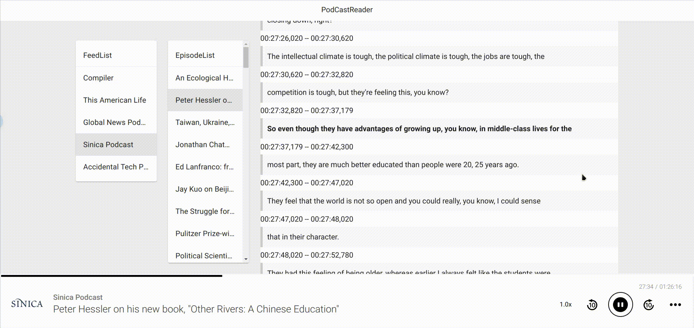
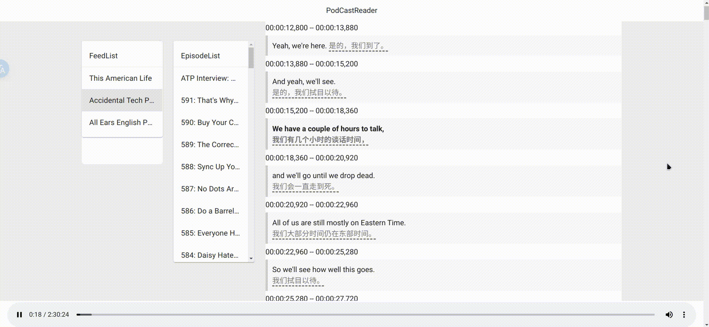

# PodCastReader
边听播客边显示字幕。

## 截图
### 默认


### 配合kiss-translator使用



## 前端
### 📦 安装

```bash
npm install
```

### 🚀 运行

```bash
npm run dev
```
    
### 🔨 构建

```bash
npm run build
```

## 字幕生成脚本
### 准备工作
进入subtitles-py目录
```
cd subtitles-py
```
新建`.env`,配置以下参数：
```
# 字幕文件夹
subtitle_folder = "../public/data/subtitles/"
# 音频文件夹
mp3_folder = "../public/data/mp3/"
# rss源文件夹
rss_folder = "../public/data/rss/"
# opml文件
opml_file = "../public/data/base.opml"

# 默认每次下载每个RSS的前几个音频
mp3_download_index = 3
```

### 环境安装
python3.10
```bash
pipenv shell
pipenv install
```

### 运行

```bash
python main.py
```
脚本运行后先会让选择是否更新RSS源，如果等待10秒后不选择，默认会更新。

然后根据参数`mp3_download_index`(在`.env`中配置)判断下载前几个音频文件。

下载完成后调用`openai-whisper`生成格式为`.json`的字幕文件。